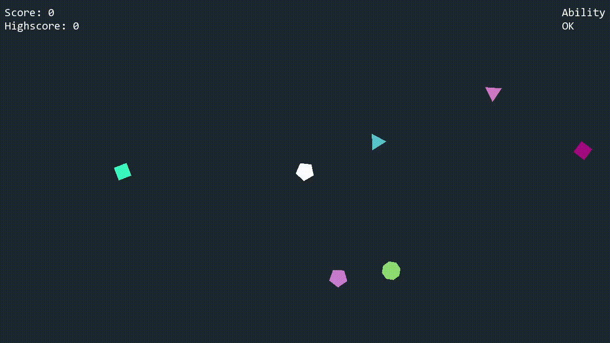
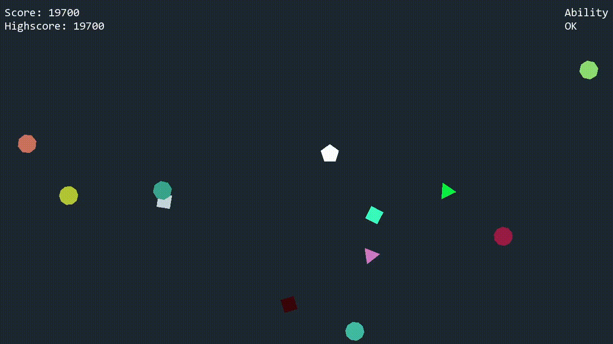
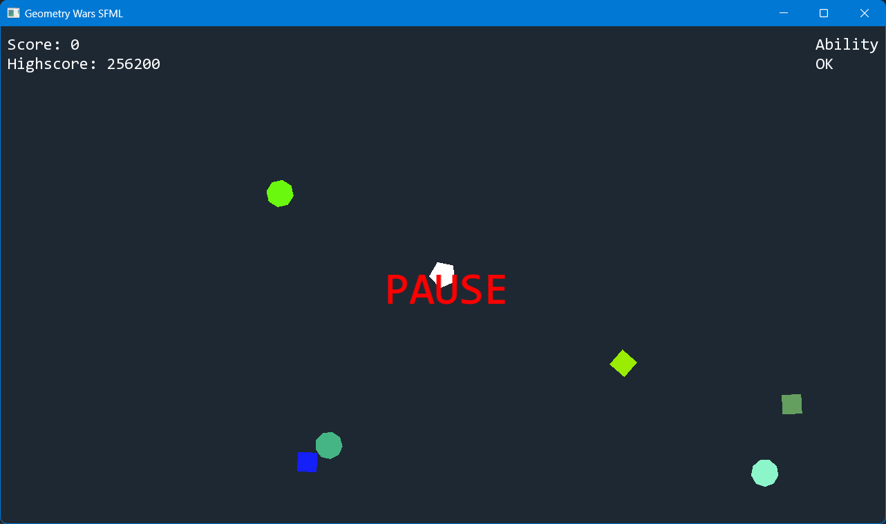

# Geometry Wars SFML C++

## Description

Implementation of a Geometry Wars game-like using SFML and C++  
Based on [**COMP4300 - Game Programming - Lecture 07 - Assignment 2**](https://www.youtube.com/watch?v=-ugbLQlw_VM) by Dave Churchill  
Uses an implementation of an Entity-Component-System (ECS) architecture  

### Gameplay





### Pause menu screenshot



## Installation

### Prerequisites

- C++/C compiler (gcc, g++, cl, clang)
- CMake 3.28 or newer

For Linux/Ubuntu, you also need to install the following dependencies:  

```bash
sudo apt-get update
sudo apt-get install -y libx11-dev \
                        libxcursor-dev \
                        libxi-dev \
                        libxrandr-dev \
                        libudev-dev \
                        libgl1-mesa-dev \
                        libfreetype6-dev \
                        libjpeg-dev \
                        libopenal-dev \
                        libflac-dev \
                        libvorbis-dev \
                        libxcb1-dev \
                        libxcb-image0-dev \
                        libxcb-randr0-dev \
                        libxcb-xtest0-dev
```

### Clone the repository

```bash
git clone https://github.com/Corentin-Mzr/Geometry-Wars-SFML
```

### Build the project

From the root folder, execute the following commands

```bash
cmake -B build
cmake --build build
```

### Run the program

To run the program, launch it from the build/bin folder

```bash
cd build/bin
./Geometry-Wars-SFML.exe
```

## Libraries

The following libraries have been used for this program

- [**SFML 3.0**](https://github.com/SFML/SFML)
- [**toml11**](https://github.com/ToruNiina/toml11)

## Controls

- WASD / ZQSD to move
- Mouse to aim
- Left click to shoot
- Right click to use ability (Berserk mode: Unlimited shoot for 10s | 30s cooldown)
- P to pause the game
- Escape to close the window

## License

This program is under the [**MIT License**](LICENSE.md)
